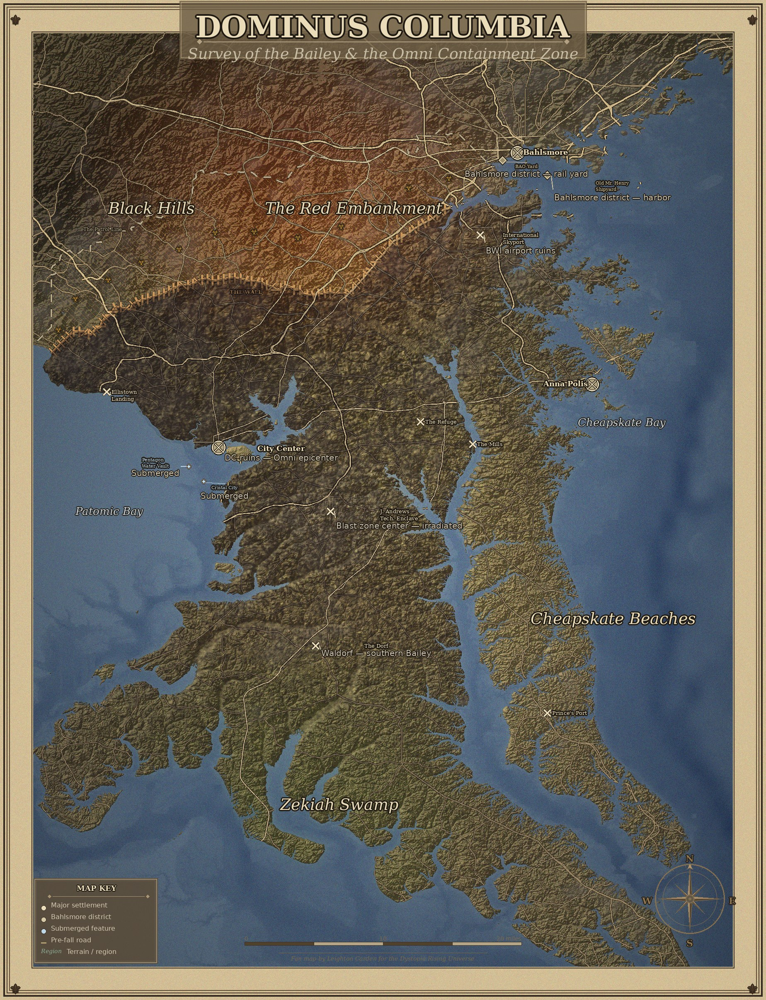

# Cartograph

**Stylized parchment maps from real terrain data.**

Cartograph builds period-cartographic-looking maps grounded in real elevation, road networks, and land-use data, then layers fictional modifications — flooding, fortification lines, contamination zones, settlement markers — on top. Every map is a YAML file. The pipeline is map-agnostic; the configs hold the storytelling.



> _Dominus Columbia — Survey of the Bailey & the Omni Containment Zone. Renders the Baltimore–DC corridor at 15m sea-level rise with the fortification line "The Wall," the "Patrol Line" buffer zone, and the "Omni Plague" contamination wave from a railway-station epicenter._

---

## What it does

- **Real terrain** — SRTM elevation mosaiced, hillshaded, and color-graded
- **Sea-level rise** — flood the coasts; create new islands, lagoons, peninsulas
- **OpenStreetMap roads** — interstates / highways / state routes, masked by water so they stop at the new shoreline
- **Fortification lines (`barriers`)** — A\*-routed walls along real road networks, with hash-mark hatching and labels
- **Buffer zones** — hatched no-go corridors between barriers, with optional symbol fills (`☣`, `☢`, custom)
- **Contamination spread** — multi-source Dijkstra from configurable epicenters (e.g. all railway stations matching an OSM tag query) with edge-noise overlays
- **Regional tints** — radial or directional color shifts for named territories (radiation glow, swampland, blast-burn, rust belts)
- **Urbanization** — grey wash over OSM-detected built-up areas
- **Cartographic furniture** — compass rose, scale bar, legend, corner ornaments, title cartouche, credit line, frame lines
- **Collision-aware label placement** — settlements compete for the 48 best candidate slots in tier order
- **100% config-driven** — the pipeline reads YAML; the YAML tells the story

## Two interfaces

| Interface                                        | Best for                                                                                                            |
| ------------------------------------------------ | ------------------------------------------------------------------------------------------------------------------- |
| **CLI** (`cartograph render config/<name>.yaml`) | Batch rendering, CI, scripting, final exports                                                                       |
| **Web editor** (`python -m src.server`)          | Iterating on a map: click-and-drag settlements, paint regions on terrain, route fortifications, balance composition |

The web editor walks you through the map in seven steps:

| #   | Step       | What you set                                                                           |
| --- | ---------- | -------------------------------------------------------------------------------------- |
| 01  | Setup      | Project name, geographic bounds, sea-level rise, color palette, fonts                  |
| 02  | Terrain    | Hillshade, palette stops, vignette, noise/scorch, urbanization, regional tints         |
| 03  | Places     | Settlements, edge indicators, infrastructure markers, water labels                     |
| 04  | Routes     | OSM road networks + per-network styles + shadow color                                  |
| 05  | Narrative  | Barriers, buffer zones, sinking regions, contamination                                 |
| 06  | Decoration | Paper, frame lines, legend, compass, scale bar, credit, ornaments                      |
| 07  | Render     | Scale × format export with presets (Discord WebP, Print A2 TIFF, Archive PNG, Working) |

Save state, undo/redo (Cmd-Z / Ctrl-Z), and shared keybindings work on every page.

## Install

```bash
git clone https://github.com/wlcarden/fictional-cartography.git
cd fictional-cartography
pip install -e .
```

**Requirements**

- Python 3.10+
- DejaVu fonts (default font path: `/usr/share/fonts/truetype/dejavu/` — most Linux distros include them; on macOS or Windows install via Homebrew/choco or override `cfg.fonts.<role>.file` to point at your installed fonts)
- ~50 MB free disk on first run for cached SRTM tiles + OSM data

## Quick start: render a map

```bash
# Render the bundled JerSea Wastes example
cartograph render config/jersea-wastes.yaml

# High-resolution print render (4× scale, ~30 s)
cartograph render config/dominus-columbia.yaml --scale 4

# Discord-ready WebP at 1× scale (~1 s after first render)
cartograph render config/dominus-columbia.yaml --format webp --quality 88

# Print-ready 300 DPI TIFF with embedded title/credit metadata
cartograph render config/dominus-columbia.yaml \
    --scale 4 --format tiff --dpi 300 --embed-metadata

# Reference overlays (state borders + real-world cities for sanity checking)
cartograph render config/jersea-wastes.yaml --reference
```

Output lands in `output/<name>.<ext>`. The first render of a new bbox downloads SRTM tiles + OSM data into `cache/` and takes ~60–90 s. Subsequent renders reuse the cache and finish in 1–3 s at 1× scale.

## Quick start: web editor

```bash
python -m src.server
# Then open http://127.0.0.1:5080/setup?project=jersea-wastes
```

The editor connects to your local YAML files in `config/`. Edits accumulate in-memory; commit-to-YAML buttons (and the auto-save on the Narrative page) persist them.

See [**docs/web-editor.md**](docs/web-editor.md) for a page-by-page guide with screenshots.

## Creating a new map

```bash
# Copy the template
cp config/_template.yaml config/my-map.yaml
```

Then either:

1. Edit the YAML directly — set `bounds`, `terrain.sea_level_rise`, add `settlements`, `regions`, `roads.networks`, etc. See [**docs/config-reference.md**](docs/config-reference.md) for the full schema.
2. Or open `http://127.0.0.1:5080/setup?project=my-map` in the editor and click through the seven steps.

Then `cartograph render config/my-map.yaml`.

## Bundled example maps

| Map                  | Config                         | Setting                                                                                                                              |
| -------------------- | ------------------------------ | ------------------------------------------------------------------------------------------------------------------------------------ |
| **JerSea Wastes**    | `config/jersea-wastes.yaml`    | Post-apocalyptic New Jersey with 10 m sea level rise. The Pine Barons, the Three Mile Fire, Aysea, Old York.                         |
| **Dominus Columbia** | `config/dominus-columbia.yaml` | Baltimore–DC corridor, 15 m rise, with the fortification line "The Wall," its buffer zone, and the Omni Plague contamination spread. |

Both are fan-fiction maps for the [Dystopia Rising](https://www.dystopiarising.com/) LARP universe; see _Disclaimer_ below.

## Project structure

```
fictional-cartography/
├── config/                  # YAML map definitions (one file per map)
├── src/
│   ├── cli.py               # Command-line entry point (`cartograph` script)
│   ├── pipeline.py          # Render orchestrator (4 cached stages)
│   ├── server.py            # Flask web editor backend
│   ├── terrain/             # SRTM mosaic, hillshade, sea-level modifications
│   ├── data/                # Overpass road/landuse fetch, US Census boundaries
│   ├── styling/             # Roads, regional tints, paper texture, barriers
│   ├── labels/              # Collision-aware label placement
│   └── furniture/           # Compass, scale bar, legend, ornaments, cartouche
├── web/                     # HTML/JS editor pages (one per route)
├── tests/playwright/        # End-to-end Playwright tests for editor pages
├── docs/                    # Detailed guides
└── cache/                   # Downloaded data (gitignored, re-fetched on demand)
```

## How it works (brief)

The render pipeline is split into four cached stages keyed by config-derived fingerprints:

1. `terrain_dem` — SRTM mosaic, crop, downsample. Slowest stage; reused across all later edits.
2. `terrain_styled` — water mask, hillshade, base colors, scorch noise, urbanization, regional tints, paper texture, vignette.
3. `canvas_with_roads` — paper-bordered canvas with roads drawn (water-masked).
4. `final` — settlements, regions, edge indicators, water labels, barriers, buffer zones, contamination, and all cartographic furniture.

Editing a setting that only affects stage 4 (e.g. moving a settlement) skips stages 1–3 entirely. This is what makes the editor responsive: the heavy lifting only re-runs when the geographic bounds, sea level, or road styles change.

For deeper dives:

- [**docs/config-reference.md**](docs/config-reference.md) — full YAML schema with every knob
- [**docs/web-editor.md**](docs/web-editor.md) — page-by-page editor guide
- [**docs/data-acquisition.md**](docs/data-acquisition.md) — SRTM tile sources, Overpass queries, caching
- [**docs/rendering-cookbook.md**](docs/rendering-cookbook.md) — the proven code patterns each pipeline stage uses

## Data sources

- **Elevation**: [SRTM](https://www.usgs.gov/centers/eros/science/usgs-eros-archive-digital-elevation-shuttle-radar-topography-mission-srtm) via AWS Open Data (`elevation-tiles-prod`)
- **Roads + land use**: [OpenStreetMap](https://www.openstreetmap.org/) via Overpass API
- **State boundaries**: US Census GeoJSON

All upstream sources are public-domain or open-data. Data is fetched on first render and cached in `cache/` (gitignored).

## Tests

```bash
# Unit-style tests (Pillow, pipeline format dispatch)
pytest

# Full Playwright sweep across all editor pages
./run_all_tests.sh
```

163 assertions across 7 Playwright suites cover: setup, paint/terrain, places, routes/decoration/render, render-page export workflow, decoration extras (compass/scale-bar/credit/ornaments/cartouche), and global settings (terrain extras + colors + fonts).

## Contributing

See [CONTRIBUTING.md](CONTRIBUTING.md) for development setup, test conventions, and guidelines.

## License

[MIT](LICENSE) — do whatever you want, attribution appreciated.

## Disclaimer

This is an unofficial fan project. **Cartograph is not affiliated with, endorsed by, or sponsored by Eschaton Media, the Dystopia Rising universe, or any rights-holder of the Dystopia Rising IP.** The bundled example maps are fan fiction created for personal use; the codebase itself is map-agnostic and works for any setting (real or fictional) you can write a YAML config for.

The terrain renderer can produce maps of real geographic locations. The fictional overlays (settlements, contamination, fortifications) are for storytelling and worldbuilding — they don't represent real-world conditions. Don't use renders for emergency planning, real navigation, or anything where accuracy matters.
