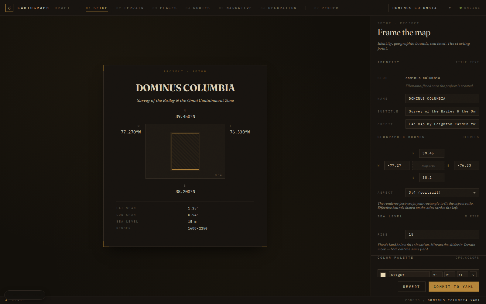
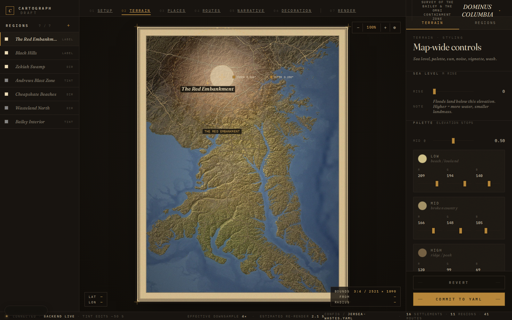
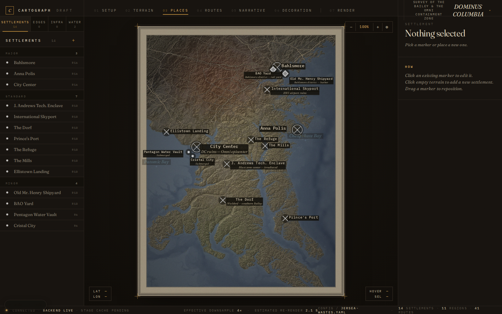
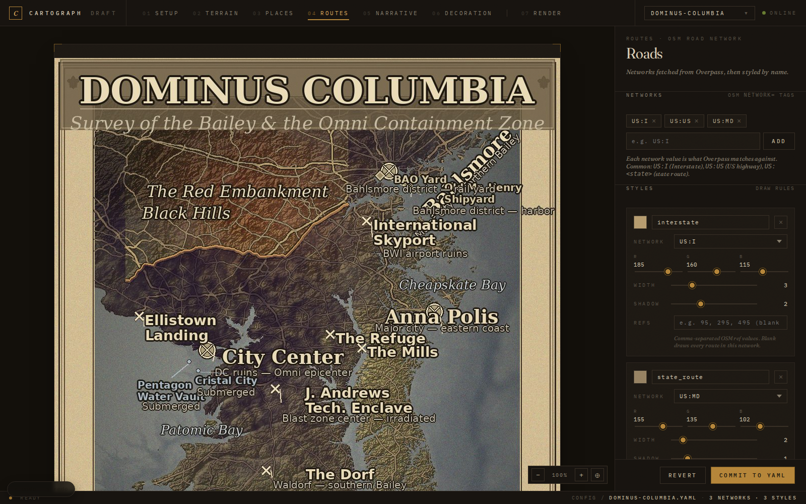
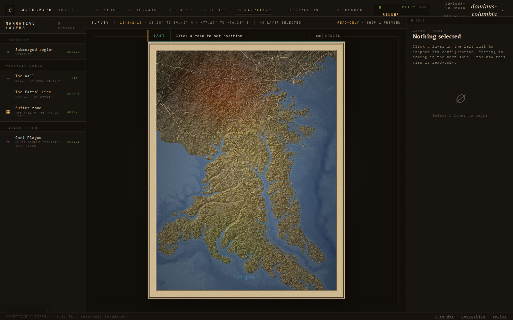
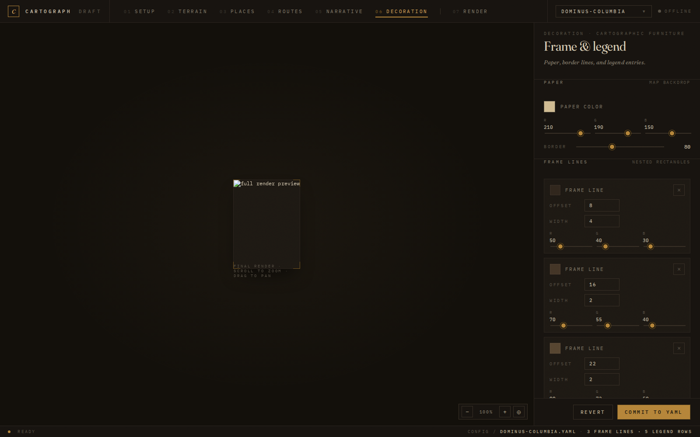
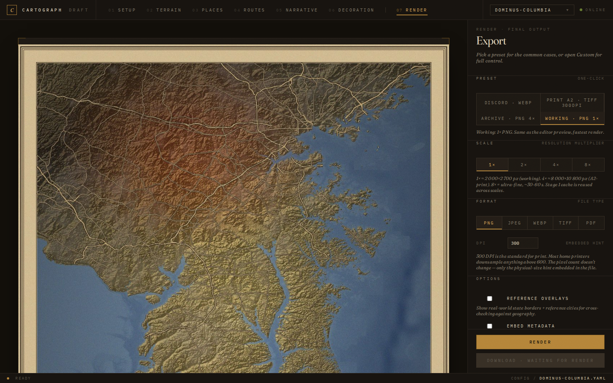

# Web editor guide

The web editor is a seven-step tour through a map's YAML config. It runs locally, reads/writes the same `config/<name>.yaml` files the CLI uses, and previews changes in-place. Each page edits a coherent slice of the config; you can hop between steps freely via the topbar nav.

## Starting the editor

```bash
python -m src.server
# → editor at http://127.0.0.1:5080/setup?project=<your-map>
```

The `?project=` query parameter selects which YAML file under `config/` you're editing. Switching projects via the project switcher (top-left) preserves the current step.

## Save state model

Two save patterns live across the seven pages:

- **Explicit commit** (Setup, Terrain, Places, Routes, Decoration, Render) — edits accumulate in browser memory until you click **Commit to YAML**. The YAML on disk is unchanged until then. A **Revert** button restores the last-loaded state.
- **Auto-save** (Narrative) — edits debounce for 700 ms and PUT to the server automatically. The status pill in the inspector reflects `idle / dirty / saving / saved / error`.

Both patterns hook into a shared **history** module: every successful save pushes a snapshot. **Cmd-Z / Ctrl-Z** undoes; **Cmd-Shift-Z / Ctrl-Y** redoes. A floating pill in the bottom-left corner shows current undo/redo availability and clicks the same actions. Text-input fields preserve their browser-native character-level undo — the global shortcut only fires when focus is outside an input.

---

## 01 — Setup



The project's identity and global parameters live here.

| Section               | What it edits                                                                                                                                                                                           |
| --------------------- | ------------------------------------------------------------------------------------------------------------------------------------------------------------------------------------------------------- |
| **Identity**          | `name`, `subtitle`, `credit` (top-level YAML strings)                                                                                                                                                   |
| **Geographic bounds** | `bounds.lat_n`, `lat_s`, `lon_w`, `lon_e` (degrees, signed). Live-updating atlas card on the left previews the rectangle.                                                                               |
| **Aspect**            | `bounds.aspect_ratio` (`free`, `1:1`, `4:3`, `3:4`, `16:9`, etc.) — enforces canvas dimensions even when the geographic rectangle has different proportions.                                            |
| **Sea level**         | `terrain.sea_level_rise` in meters. Shared knob with the Terrain page.                                                                                                                                  |
| **Color palette**     | `cfg.colors` — the named-color dictionary referenced by settlements / regions / legend / state-boundary highlights. Each row: swatch + name + R/G/B inputs + delete. **+ Add color** appends a new row. |
| **Fonts**             | `cfg.fonts` — per-role font definitions (`major`, `minor`, `region`, `settle`, `compass`, `scale`, plus any custom roles like `bold_13`). Edit file/size in place; **+ Add role** for new roles.        |
| **Status**            | Read-only render-cache info: dimensions, settlement/region counts, last render timestamp.                                                                                                               |

The atlas card on the left renders a live preview of the bounds + name + subtitle, regardless of whether you've committed yet.

**New-project flow.** The project switcher's **+ New project…** entry seeds a fresh config from `_template.yaml` under a slug you choose, then redirects to the new project's setup page.

---

## 02 — Terrain (route: `/paint`)



The terrain panel covers everything visual about the underlying map _before_ settlements/labels/furniture get drawn. The right inspector has two tabs:

### Terrain tab (default)

| Section              | YAML                                                                      | What it does                                                                                                                            |
| -------------------- | ------------------------------------------------------------------------- | --------------------------------------------------------------------------------------------------------------------------------------- |
| **Sea level**        | `terrain.sea_level_rise`                                                  | Floods land below this elevation. Mirrors the slider in Setup.                                                                          |
| **Palette**          | `terrain.palette.{low,mid,high,mid_break}`                                | Three RGB stops driving the elevation gradient. `mid_break` (0–1) sets where the mid stop sits along the elevation range.               |
| **Sun**              | `terrain.shade.{sun_altitude,sun_azimuth,floor}`                          | Hillshade direction (azimuth in compass degrees, altitude 5–85°) and floor (ambient minimum).                                           |
| **Vignette**         | `terrain.vignette.{strength,floor}`                                       | Radial darkening at canvas corners.                                                                                                     |
| **Noise**            | `terrain.noise.{drift_sigma,drift_strength,scorch_sigma,scorch_strength}` | Two perlin-style noise overlays — drift (smooth color shifts) and scorch (sharper burn patches).                                        |
| **Wasteland wash**   | `terrain.wasteland_wash.{desaturate,warm_push_r,cool_push_b}`             | Final-stage color grade. Negative warm/cool pushes are valid.                                                                           |
| **Coastline darken** | `terrain.coastline_darken.{dilation,factor}`                              | Darkens the land side of every coastline edge for emphasis.                                                                             |
| **Water palette**    | `terrain.water.{shallow,deep,depth_range}`                                | Two RGB stops for water surface coloring; depth_range sets how quickly shallow→deep transitions across the bathymetry.                  |
| **Urbanization**     | `cfg.urbanization.{enabled,blend_strength,color}`                         | Grey wash blended over OSM-detected built-up areas. Color is in 0–1 RGB.                                                                |
| **Resolution**       | `terrain.downsample`                                                      | DEM pixel-density divisor. 1× = full res (slow), 4× = working speed, 8× = quick preview. Render-time `--scale` multiplies this back up. |

### Region tab (auto-shown on click)

When you click a region on the map (or a row in the left rail), the inspector switches to the per-region editor:

- **Identity** — name, subtitle (optional), region type (`region_label` for both label + tint, `tint_only` for tint without text)
- **Tint type** — `radial` (center + inner/outer radii) or `directional` (anchor + direction d-pad + range)
- **Adjustments** — R/G/B color shifts (-1 to +1), strength, desaturate
- **Color** — the named color for the region label

Click **+ Add region** in the left rail to drop a default radial tint at the map center.

---

## 03 — Places (route: `/place`)



Four kinds of place markers, switchable via tabs in the left rail:

| Tab                 | YAML                | What it is                                                                                                                                                                                |
| ------------------- | ------------------- | ----------------------------------------------------------------------------------------------------------------------------------------------------------------------------------------- |
| **Settlements**     | `settlements[]`     | The primary point markers. Tier (radius/font), color, label side (auto/left/right/above/below), manual offset (Shift+drag), rotation, marker glyph (`circle`, `circled_x`, custom), note. |
| **Edge indicators** | `edge_indicators[]` | Arrows along the canvas edges pointing offstage ("← three mile fire"). Edge: `west`/`east`/`north`/`south`/`center`.                                                                      |
| **Infrastructure**  | `infrastructure[]`  | Lower-priority markers (bridges, gates, choke-points) shown as small text + optional note.                                                                                                |
| **Water labels**    | `water_labels[]`    | Italicized place names for bays, rivers, oceans. Rotation supported.                                                                                                                      |

Click anywhere on the map to drop a new item of the active tab's type. Click a marker to select it. Drag to reposition. Shift+drag a label to nudge its position relative to the marker (sets `label_offset`); drag without shift moves the marker.

The inspector exposes everything the YAML supports for the selected item type, with sensible tier-based defaults for new settlements.

---

## 04 — Routes (route: `/routes`)



The OSM road networks the renderer fetches and how each one is drawn.

| Section           | YAML                                                     | What it is                                                                                                                                                  |
| ----------------- | -------------------------------------------------------- | ----------------------------------------------------------------------------------------------------------------------------------------------------------- |
| **Networks**      | `roads.networks[]`                                       | List of OSM `network=` tag values to fetch (e.g. `US:I` for Interstates, `US:US` for US Highways, `US:NJ` for New Jersey state routes).                     |
| **Styles**        | `roads.styles.{name}.{network,color,width,shadow_width}` | Per-style rendering. Multiple named styles can reference the same network with different color/width — e.g. a "highlighted" style overlaid on a base style. |
| **Shadow color**  | `roads.shadow_color`                                     | RGB shadow under all roads.                                                                                                                                 |
| **Mask by water** | `roads.mask_by_water`                                    | When true, roads stop at the post-flood shoreline. When false, roads draw straight across underwater terrain.                                               |

The map preview re-fetches the road network when you change `networks` and re-renders the road layer when you change styles. New networks fire an Overpass query on commit; expect a few seconds for the first render of any new network.

---

## 05 — Narrative (route: `/narrative`)



Where the storytelling lives. Five elements share this page; each shows up as a row in the left rail and gets its own inspector when selected.

| Element                     | YAML                                                               | What it is                                                                                                                                                                                                                                                                     |
| --------------------------- | ------------------------------------------------------------------ | ------------------------------------------------------------------------------------------------------------------------------------------------------------------------------------------------------------------------------------------------------------------------------ |
| **Sinking**                 | `sinking.{enabled,method,region,source}`                           | Force a region to be underwater regardless of elevation. Currently supports `nan_mask` (overlay a polygon mask from a `.json` source file).                                                                                                                                    |
| **Barriers** (one row each) | `barriers[]`                                                       | Walls/fortification lines. Each barrier specifies endpoints + method (`astar_road_network` follows real roads; `astar_offset` parallels another barrier). Style = color, width, hash marks. Label = text + position. Optional corridor constraints (lat/lon bounds + penalty). |
| **Buffer zone**             | `buffer_zone.{between,enabled,hatching,symbols}`                   | A hatched no-go corridor between two named barriers. Optional symbol fill (`☣`, `☢`, custom Unicode).                                                                                                                                                                          |
| **Contamination**           | `contamination.{enabled,method,sources,spread,overlay,edge_noise}` | Multi-source spread from configurable epicenters. Sources can be an `osm_query` (e.g. all railway stations matching a tag) or a manual list. Spread blocks at water + named barriers. Overlay color + opacity + edge-noise octaves shape the visualization.                    |

Auto-save fires 700 ms after edits stop. The status pill shows `idle → dirty → saving → saved`.

**Pick mode.** Several inspectors have a **Pick on map** affordance — click it, then click on the map canvas to set a coordinate (e.g. a barrier endpoint or contamination epicenter). Press Esc to cancel.

---

## 06 — Decoration (route: `/decoration`)



Cartographic furniture — the chrome around the map content.

| Section              | YAML                                                                             | What it is                                                                                                                                   |
| -------------------- | -------------------------------------------------------------------------------- | -------------------------------------------------------------------------------------------------------------------------------------------- |
| **Paper**            | `canvas.paper_color`, `canvas.border`                                            | Background paper color (RGB) and outer margin (px).                                                                                          |
| **Frame lines**      | `canvas.border_lines[]`                                                          | Nested rectangular frame lines drawn inside the border. Each: offset (px from canvas edge), color, width.                                    |
| **Legend**           | `legend.entries[]`                                                               | Per-entry: type (`circle`, `line`, `italic_text`), color (named or RGB), label.                                                              |
| **State boundaries** | `state_boundaries.{enabled,states,highlight,highlight_color,other_color}`        | Optional US-state-border overlay; one state can be highlighted.                                                                              |
| **Reference cities** | `reference_cities.{enabled,cities[]}`                                            | Optional dot markers for real-world cities — useful for sanity-checking your map's geography.                                                |
| **Compass rose**     | `decoration.compass.{enabled,position,radius_pct,offset_x,offset_y}`             | Position is one of `bottom-right` / `bottom-left` / `top-right` / `top-left`. `radius_pct=0` = auto.                                         |
| **Scale bar**        | `decoration.scale_bar.{enabled,position,bar_miles,segments,offset_from_border}`  | Position is one of `bottom-center` / `bottom-left` / `bottom-right`. Bar shows N miles in M alternating segments.                            |
| **Credit line**      | `decoration.credit.{enabled,divider,offset_from_border}`                         | Centered credit at the bottom; offset is from the inner border line so the text stays inside the frame. Divider line above is optional.      |
| **Corner ornaments** | `decoration.ornaments.{enabled,glyph,size,color,inset_x,inset_top,inset_bottom}` | Glyph picker (⚜ ✦ ✧ ❋ ◆ ✤ ✣ ✱) plus a custom-character text input. Size is base font px. Color is a single RGB; the shadow auto-darkens 55%. |
| **Title cartouche**  | `decoration.cartouche.enabled`                                                   | The decorative box around the title at the top center. Toggle on/off.                                                                        |

---

## 07 — Render (route: `/render`)



Final export. The right inspector has four sections:

| Section                                      | What it does                                                                                                                                                                                                                                              |
| -------------------------------------------- | --------------------------------------------------------------------------------------------------------------------------------------------------------------------------------------------------------------------------------------------------------- |
| **Preset**                                   | Four one-click chips: **Discord (WebP 1×)**, **Print A2 (TIFF 4× 300 DPI)**, **Archive (PNG 4×)**, **Working (PNG 1×)**. Each populates the controls below; you can tweak afterwards.                                                                     |
| **Scale / Format / Quality / DPI / Options** | Manual export controls. Scale 1×–8×; format PNG / JPEG / WebP / TIFF / PDF. Quality slider visible only for lossy formats. DPI input visible only for formats that store the hint (PNG / TIFF / PDF). Reference-overlay toggle and embed-metadata toggle. |
| **Stages**                                   | Per-stage download links. Three layered PNGs are cached during render: terrain only, terrain + roads, final composite. Useful for layered work in image editors.                                                                                          |
| **Recent renders**                           | Session render history — last 5 renders for the current project, persisted to `localStorage`. Click any row to download.                                                                                                                                  |

Render time scales roughly: 1× ≈ 1–2 s · 2× ≈ 3–6 s · 4× ≈ 10–30 s · 8× ≈ 30–60 s. Stage 1 (SRTM) is cached across scales, so the cost difference is in stages 2–4 which pixel-scale linearly.

---

## Keyboard reference

| Shortcut                 | Action                                     | Where                                          |
| ------------------------ | ------------------------------------------ | ---------------------------------------------- |
| **Cmd-Z / Ctrl-Z**       | Undo                                       | Any page (skipped when typing in a text input) |
| **Cmd-Shift-Z / Ctrl-Y** | Redo                                       | Same                                           |
| **Esc**                  | Cancel pick-mode                           | Narrative                                      |
| **Shift+drag**           | Nudge label position (sets `label_offset`) | Places                                         |
| **+ / −**                | Zoom in/out                                | Routes / Decoration                            |
| **Drag empty area**      | Pan                                        | Routes / Decoration                            |

## Troubleshooting

**Editor shows "offline."** The Flask server isn't reachable. Run `python -m src.server` in another terminal.

**Long delay on first render.** First render of a new bbox downloads SRTM tiles + Overpass road queries (~30–60 s on a slow connection). Subsequent renders reuse `cache/`.

**A new road network shows nothing.** Check the network value matches an OSM `network=` tag (e.g. `US:I`, not `US:Interstate`). The Overpass cache lives at `cache/overpass/<config-name>_<network>.json` — delete it to force a re-fetch.

**Setup → bounds change → "next render rebuilds from scratch" warning.** Bounds invalidate every cache stage. Confirm + commit; the next render will take ~60 s.

**Undo doesn't work for character-level edits.** Intentional. Inside text inputs, the browser's native undo handles per-keystroke. The shared undo only operates at snapshot granularity (one snapshot per save).
